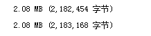
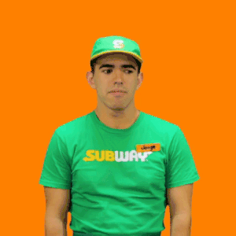
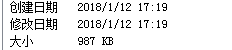
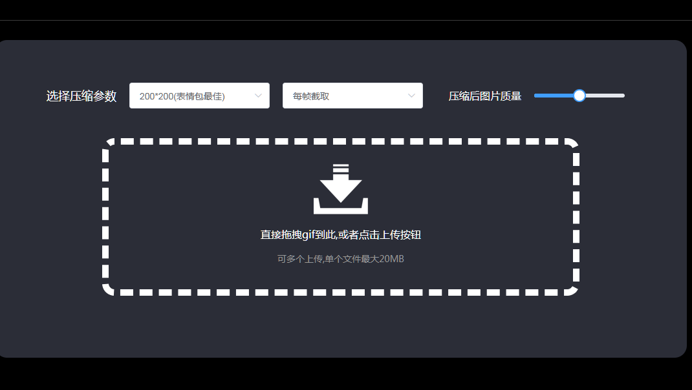

# GIF表情压缩神器(几乎无损) 纯JS打造 https://github.com/JesseWeb/minifyGif_NODE-WEB


## 前言:

本人酷爱发表情包，遂喜欢在各大网站找寻 GIF 动图，然后再去别的网站压缩。本来是有一个免费的压缩网站，虽然不能设置各种宽高、质量等参数，大多时候也基本满足需求。

但是！！这个网站貌似是不做了还是挂了！！！

没有新表情的日子很痛苦，遂决定自己用js打造一个压缩器，view也已经写好

先看看效果吧 ---这张gif原图





压缩后



是不是很强?

## 使用方法

既然是JS 肯定要先装好[NODEJS](http://nodejs.cn/download/)环境啦

然后将本项目clone到本地
```
git clone https://github.com/JesseWeb/minifyGif_NODE-WEB.git
```
安装图片处理库的依赖[GraphicsMagick](https://sourceforge.net/projects/graphicsmagick/files/)

进入项目中 ```npm install```

等待所有依赖包安装完毕

```
npm run start
```
本程序会监听3000端口

如果想改监听端口,请在server.js中修改port变量为你想要监听的端口

弹出server listen to 3000后,证明此程序已经跑起来了

在浏览器中输入localhost:3000 即可进入页面



调节好你要的参数后,将你要的图片拖入即可.由于是本地操作,所以处理起来非常快。


## 主要功能
### 对 GIF 进行压缩,压缩方式有三种:

1. 利用 GIF 质量进行压缩,主要是减少色盘

2. 利用 GIF 宽高进行压缩,将图片宽高减少进而压缩,当然了,你也可以将图片大小进行放大,但是会增加图片大小.
3. 对 GIF 进行帧提取,跳过画面中的某些部分,比如一些帧率很高的图片,就可以进行2帧一提取,图片大小会减小很多

具体使用功能压缩成什么样子,还请大家自己去研究,找到最适合的图片参数

## Future
加入指定压缩后文件size的形式来压缩,可选通过高度或质量达到压缩至指定size(kb)

## 友情链接

view实现框架 [Vue](https://cn.vuejs.org/)

viewMaterial框架[element](https://github.com/ElemeFE/element)

主要算法参考
[舞动的表情包——浅析GIF格式图片的存储和压缩](https://mp.weixin.qq.com/s/v0pffOhjFWnVbU2lXjuEmw)

主要图片解析库 [gm](https://github.com/aheckmann/gm)

主要图片处理库 [Gifsicle](http://www.lcdf.org/gifsicle/)
